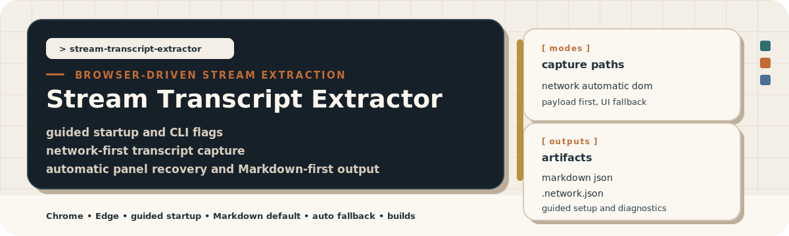

`Stream Transcript Extractor` pulls Microsoft Teams recording transcripts from
Microsoft Stream through a real signed-in Chrome or Edge profile. It prefers
the transcript payload behind the Stream UI, falls back to DOM capture when
needed, and keeps the public source surface small enough to audit quickly.

This repository is designed around three outcomes:

- Keep extraction reliable across Stream transport changes.
- Keep the operator workflow small when the Stream UI gets inconsistent.
- Keep the source workflow easy to share: one core extractor runtime, one
  workflow-first CLI entrypoint, a shared CLI library, one build file, and
  generated README assets with a documented source of truth.

---


The runtime surface stays intentionally small at the entrypoint and explicit
in the implementation. [`cli.js`](./cli.js) is the single public CLI
entrypoint and workflow router. The implementation now lives in focused
modules under [`lib/`](./lib), including shared CLI/runtime wiring in
[`lib/cli.js`](./lib/cli.js) and
[`lib/extractor-cli-runtime.js`](./lib/extractor-cli-runtime.js), browser
launch and attachment helpers in [`lib/browser-session.js`](./lib/browser-session.js)
and [`lib/cdp.js`](./lib/cdp.js), crawl and batch extraction flow in
[`lib/network-mode-runtime.js`](./lib/network-mode-runtime.js) and
[`lib/crawl-state.js`](./lib/crawl-state.js), and transcript capture and
output helpers such as
[`lib/connected-session-extraction.js`](./lib/connected-session-extraction.js),
[`lib/transcript-network.js`](./lib/transcript-network.js), and
[`lib/transcript-output.js`](./lib/transcript-output.js). [`build.js`](./build.js)
builds release binaries, [`assets/`](./assets) holds the architecture diagram
and generated README graphics, and [`scripts/`](./scripts) is the source of
truth for those graphics and README validation.

The project supports two operator flows:

- `cli.js` is the single-meeting workflow. It supports three capture
  modes.
- `cli.js crawl` opens Stream home, switches to **Meetings**, scrolls the
  full list, merges newly discovered items into a persistent crawl state file,
  lets you select items in the terminal with progress-aware labels, and
  reuses the same browser session to run the `automatic` extractor for each
  selected meeting.

The help surface now follows the workflow too. `bun ./cli.js --help`
shows the top-level map, `bun ./cli.js --mode automatic --help` shows the
single-meeting network workflow, and `bun ./cli.js crawl --help` shows
the batch discovery, queue state, and selection flow.

When you launch `bun ./cli.js` with no arguments in a real terminal, it
opens the same interactive launcher that the compiled binary uses. That
launcher lets you choose `extract` or `crawl`, then set the recommended
workflow options before the run starts.

The extractor capture modes stay the same:

- `automatic` is the recommended and default path. It builds on the same
  network extractor, reloads the page with capture armed, tries to open the
  **Transcript** panel for you, nudges the UI to trigger lazy loading, and
  falls back to manual help only after it explains what it could and could
  not confirm.
- `network` is the advanced low-level path. It captures the Stream transcript
  payload directly, decrypts it when needed, and writes richer meeting
  metadata when you want to drive the panel-open timing yourself.
- `dom` is the fallback path. It scrolls the rendered transcript panel and
  extracts entries from the visible UI when the transport layer is unsuitable
  or when you need UI-level debugging.

Recommended CLI defaults:

- single-meeting extraction: `automatic`
- transcript output format: `md`
- crawl discovery settle window: `10000` ms (`10` seconds)
- diagnostics: leave `--debug` off unless you are diagnosing a failure

The crawl workflow always wraps the `automatic` extractor in one browser
session.

The tool does not use Microsoft Graph transcript APIs. It works through the
browser session you already have.

> [!IMPORTANT]
> The selected Chrome or Edge profile must already be able to open the target
> Microsoft Stream recordings and transcripts.

Use the source workflow when you want the simplest shareable entrypoint. Use a
release binary when you want a standalone executable without requiring Bun.

Requirements:

- macOS or Windows
- Google Chrome or Microsoft Edge
- A signed-in browser profile that can already open the recording and
  transcript
- Bun `1.2.4` or later for the source workflow
- Python 3 if you want to regenerate README assets or validate the README

You do not need Bun or Python when you run a built binary.

---


You can run the extractor directly from source or use a standalone binary from
the release page. Both paths still require Chrome or Edge on the target
machine because the extractor attaches to a real browser profile.

Run from source:

```bash
mise install
bun ./cli.js
bun ./cli.js --help
bun ./cli.js --mode automatic --help
bun ./cli.js crawl --help
```

Run from a release binary:

```bash
# macOS arm64 example
./stream-transcript-extractor-macos-arm64
./stream-transcript-extractor-macos-arm64 --help
./stream-transcript-extractor-macos-arm64 crawl --help

# Windows x64 example
.\stream-transcript-extractor-windows-x64.exe
.\stream-transcript-extractor-windows-x64.exe --help
.\stream-transcript-extractor-windows-x64.exe crawl --help
```

The latest binaries are published on the
[latest release page](https://github.com/benjaminwestern/stream-transcript-extractor/releases/latest).

These commands cover the common operator paths:

```bash
# Recommended interactive launcher path
bun ./cli.js

# Recommended direct single-meeting path
bun ./cli.js --mode automatic

# Force a mode
bun ./cli.js --mode network
bun ./cli.js --mode dom

# Pick a browser or profile
bun ./cli.js --browser chrome --profile Work
bun ./cli.js --browser edge --profile "user@example.com"

# Choose output
bun ./cli.js --format md --output weekly-standup
bun ./cli.js --format both --output weekly-standup

# Diagnostics only when needed
bun ./cli.js --output-dir ./exports --debug

# Crawl Meetings and batch-extract selected items
bun ./cli.js crawl
bun ./cli.js crawl --browser chrome --profile Work
bun ./cli.js crawl --output-dir ./exports --format md
bun ./cli.js crawl --output-dir ./exports --format both
bun ./cli.js crawl --debug
bun ./cli.js crawl --state-file ./exports/team.state.json
bun ./cli.js crawl --wait-before-discovery-ms 10000
bun ./cli.js crawl --select pending --browser edge

# Show help or version
bun ./cli.js --help
bun ./cli.js --version
bun ./cli.js crawl --help
```

The extract workflow CLI options are:

| Option | Purpose |
| --- | --- |
| `--mode <network\|automatic\|dom>` | Choose the extractor mode. Recommended and default: `automatic`. |
| `--browser <chrome\|edge>` | Use a specific browser instead of choosing interactively. |
| `--profile <query>` | Match a profile by name, email, or directory name. |
| `--output <name>` | Override the output filename prefix. |
| `--output-dir <path>` | Write output files to a custom directory. |
| `--format <json\|md\|both>` | Write JSON, Markdown, or both. Recommended and default: `md`. |
| `--debug-port <port>` | Force a specific remote debugging port. |
| `--debug` | Write extra diagnostics for the selected mode. Recommended default: off. |
| `--keep-browser-open` | Leave the launched browser open after extraction. |
| `--help` | Print the CLI help text. |
| `--version` | Print the embedded build version. |

The no-arguments interactive launcher covers the common settings from the same
CLI contract:

- workflow selection: `extract` or `crawl`
- extract mode: `automatic`, `network`, or `dom`
- output format: `md`, `json`, or `both`
- diagnostics: `--debug` on or off
- browser preference: auto-detect, Chrome, or Edge
- crawl settle wait: recommended `10000` ms, `30000` ms, or a custom value
- advanced overrides: `--profile`, `--output-dir`, `--output`,
  `--debug-port`, and for crawl `--start-url`, `--state-file`, and `--select`

The crawl workflow CLI options are:

| Option | Purpose |
| --- | --- |
| `--browser <chrome\|edge>` | Use a specific browser instead of choosing interactively. |
| `--profile <query>` | Match a profile by name, email, or directory name. |
| `--start-url <url>` | Override the Stream home URL used before the crawler switches to **Meetings**. |
| `--state-file <path>` | Override the persistent crawl queue state file. |
| `--select <spec>` | Select queue items non-interactively with `pending`, `new`, `failed`, `done`, `all`, or numeric ranges. |
| `--wait-before-discovery-ms <ms>` | Delay discovery after the Stream URL opens so auth and page load can settle. Recommended and default: `10000` ms (`10` seconds). |
| `--output <name>` | Override the batch status filename prefix. |
| `--output-dir <path>` | Write transcript and batch status files to a custom directory. |
| `--format <json\|md\|both>` | Write JSON, Markdown, or both transcript outputs. Recommended and default: `md`. |
| `--debug-port <port>` | Force a specific remote debugging port. |
| `--debug` | Save extended network diagnostics for each extracted item. Recommended default: off. |
| `--keep-browser-open` | Leave the launched browser open after the batch run. |
| `--help` | Print the CLI help text. |
| `--version` | Print the embedded build version. |

---


All three modes solve the same user problem, but they optimize for different
failure patterns. The entrypoint stays stable. The operator flow changes only
after you choose the mode.

| Mode | What it does | Use it when |
| --- | --- | --- |
| `automatic` | Uses the network path, reloads with capture armed, tries to open the **Transcript** panel, nudges the UI, retries once, and only then falls back to manual help. | Recommended default. You want the lowest operator effort while still using the network extractor. |
| `network` | Captures transcript-related network responses, loads response bodies, decrypts payloads when needed, and parses transcript entries from the transport layer. | You want the lowest-level path, richer metadata, and direct control over when the panel is opened. |
| `dom` | Scrolls the rendered transcript UI and extracts entries from the visible DOM. | You need a fallback when the transport changes, or you want to inspect the rendered transcript itself. |

Mode-specific operator flow:

- `network`: Open the recording page with the **Transcript** panel closed.
  Return to the terminal, arm capture, then open the panel after the extractor
  tells you capture is live.
- `automatic`: Open the recording page and return to the terminal. The
  extractor reloads the page, attempts the transcript-panel actions for you,
  and explains why it fell back if it still needs manual help.
- `dom`: Open the recording page and the **Transcript** panel before
  extraction begins. The extractor then scrolls the visible transcript UI.

Leave `--debug` off for normal runs. Use `--debug` when you want to see the
deeper diagnostics for the selected mode. In `automatic` mode, that includes
the full UI action trace, retry flow, and fallback reason.

<br>

---


Each run can write JSON, Markdown, or both. The transcript outputs stay
intentionally simple so they work for review, archive, LLM input, or diffing
across browsers and operating systems.

The crawl workflow also writes two queue artifacts:

- `*.state.json` is the persistent crawl queue. It records discovered meeting
  URLs, progress state, and the latest extraction outcome per item so the next
  run can merge in new discoveries without losing prior progress.
- `*.batch.json` is the current run summary. It records the current discovery
  result, the terminal selection, and the success or failure state for each
  extracted item.

Mode-specific output behavior:

| Mode | Transcript files | Diagnostic behavior |
| --- | --- | --- |
| `network` | Writes `.json`, `.md`, or both based on `--format`. | `*.network.json` is written only when you use `--debug`, whether the run succeeds or fails. The terminal still prints a live confirmation when likely transcript traffic is seen. |
| `automatic` | Writes the same transcript files as `network`. | `*.network.json` is written only when you use `--debug`. `--debug` also prints the UI action trace, retry attempts, and fallback diagnosis. |
| `dom` | Writes the same transcript files as the other modes. | `--debug` writes `*.debug.json` with DOM-level diagnostics. |

Run summaries also distinguish between potentially relevant network responses
and actual parsed transcript payload matches, which makes failed captures less
misleading during triage.

<details>
<summary>Sample JSON transcript output</summary>

```json
{
  "meeting": {
    "title": "Weekly Standup - Project Alpha",
    "date": "March 30, 2026",
    "createdBy": "Jane Smith",
    "createdByEmail": "jane.smith@example.com",
    "sourceUrl": "https://contoso.sharepoint.com/.../stream.aspx?id=...",
    "recordingStartDateTime": "2026-03-30T00:04:18.0183508Z",
    "recordingEndDateTime": "2026-03-30T00:40:06.0592754Z"
  },
  "extractedAt": "2026-03-30T08:50:18.000Z",
  "entryCount": 142,
  "speakers": [
    "Alice Johnson",
    "Bob Chen",
    "Charlie Davis"
  ],
  "entries": [
    {
      "speaker": "Alice Johnson",
      "timestamp": "0:03",
      "text": "Whether it is ChatGPT or Gemini, that is more of an SEO problem."
    }
  ]
}
```

</details>

<details>
<summary>Sample Markdown transcript output</summary>

```md
Transcript information

Title: Weekly Standup - Project Alpha
Date: March 30, 2026
Start date/time: March 30, 2026 at 12:04:18 AM UTC
End date/time: March 30, 2026 at 12:40:06 AM UTC
Created by: Jane Smith <jane.smith@example.com>
Speakers: Alice Johnson, Bob Chen, Charlie Davis
Source URL: https://contoso.sharepoint.com/.../stream.aspx?id=...
Extracted at: 2026-03-30T08:50:18.000Z
Entry count: 142

---

Alice Johnson - 0:03:
Whether it is ChatGPT or Gemini, that is more of an SEO problem.
```

</details>

---


The extractor keeps the user flow small, but there is still a fair amount
happening under the hood so the browser session stays usable and the output
remains stable across Chrome, Edge, macOS, and Windows.


The diagram source lives in
[`assets/extractor-architecture.d2`](./assets/extractor-architecture.d2), and
the rendered asset lives in
[`assets/extractor-architecture.svg`](./assets/extractor-architecture.svg).

Three design decisions matter most:

- [`cli.js`](./cli.js) stays thin. It routes between `extract` and `crawl`,
  while the real implementation lives in focused runtime modules under
  [`lib/`](./lib).
- Browser/session management, crawl discovery/state, transcript capture, and
  transcript rendering are split into separate modules, so the batch flow and
  single-meeting flow reuse the same lower-level code instead of carrying
  duplicated runtimes.
- The extractor uses your existing signed-in browser profile instead of asking
  for credentials or app registrations.
- The network-backed path is preferred because Stream's transcript UI is
  virtualized and more likely to drift than the underlying payload transport.


The README now has an explicit source of truth instead of hand-edited visual
assets. If you change the banner, section headers, or visual system, update
[`scripts/generate_assets.py`](./scripts/generate_assets.py) first, then
regenerate the SVGs in [`assets/`](./assets).

Repository script surface:

| Command | Purpose |
| --- | --- |
| `bun ./cli.js --help` | Print the extractor CLI contract. |
| `bun ./cli.js --mode automatic --help` | Print the mode-specific network capture workflow. |
| `bun ./cli.js crawl --help` | Print the crawl workflow CLI contract. |
| `bun ./build.js --help` | Print the standalone build contract. |
| `python3 scripts/generate_assets.py` | Regenerate the README banner and section header SVG files. |
| `python3 scripts/validate_readme.py` | Validate README asset references and local documentation links. |
| `mise run generate-assets` | Convenience wrapper for `python3 scripts/generate_assets.py`. |
| `mise run validate-docs` | Convenience wrapper for `python3 scripts/validate_readme.py`. |

Generated README asset files:

- [`assets/banner.svg`](./assets/banner.svg)
- [`assets/header-overview.svg`](./assets/header-overview.svg)
- [`assets/header-install.svg`](./assets/header-install.svg)
- [`assets/header-modes.svg`](./assets/header-modes.svg)
- [`assets/header-outputs.svg`](./assets/header-outputs.svg)
- [`assets/header-architecture.svg`](./assets/header-architecture.svg)
- [`assets/header-scripts.svg`](./assets/header-scripts.svg)
- [`assets/header-build.svg`](./assets/header-build.svg)
- [`assets/header-troubleshooting.svg`](./assets/header-troubleshooting.svg)
- [`assets/header-repository.svg`](./assets/header-repository.svg)

Treat those SVGs as generated files. Edit the Python generator, rerun it, and
commit the resulting assets together with the script change that produced them.

---


You can run the extractor directly from source, or you can compile standalone
binaries with Bun. The built artifacts still require Chrome or Edge on the
target machine, but they do not require Bun or Node.js. The build script
produces standalone executables in `dist/`; it does not produce DMG files or
installer packages.

Build from source:

```bash
# Show build usage
bun ./build.js --help

# Build all supported targets
bun ./build.js

# Build a single target
bun ./build.js macos-arm64
bun ./build.js macos-x64
bun ./build.js windows-x64
```

Artifacts land in `dist/`:

| Artifact | Target |
| --- | --- |
| `dist/stream-transcript-extractor-macos-arm64` | Apple Silicon Macs |
| `dist/stream-transcript-extractor-macos-x64` | Intel Macs |
| `dist/stream-transcript-extractor-windows-x64.exe` | Windows x64 |

The macOS release artifact is the standalone executable itself. If you want
to distribute it to other Macs, sign it and package it separately as part of
your release process.

Set `BUILD_VERSION` if you want a specific embedded version string:

```bash
BUILD_VERSION=1.0.0 bun ./build.js windows-x64
```

<details>
<summary>macOS signing example</summary>

If you distribute the macOS binary to other machines, sign it first so
Gatekeeper does not block it:

```bash
security find-identity -v -p codesigning

cat > signing-entitlements.plist <<'PLIST'
<?xml version="1.0" encoding="UTF-8"?>
<!DOCTYPE plist PUBLIC "-//Apple//DTD PLIST 1.0//EN" "http://www.apple.com/DTDs/PropertyList-1.0.dtd">
<plist version="1.0">
<dict>
  <key>com.apple.security.cs.allow-jit</key>
  <true/>
  <key>com.apple.security.cs.allow-unsigned-executable-memory</key>
  <true/>
  <key>com.apple.security.cs.disable-executable-page-protection</key>
  <true/>
  <key>com.apple.security.cs.allow-dyld-environment-variables</key>
  <true/>
  <key>com.apple.security.cs.disable-library-validation</key>
  <true/>
</dict>
</plist>
PLIST

codesign \
  --entitlements signing-entitlements.plist \
  --deep \
  --force \
  --sign "Developer ID Application: Your Name (TEAMID)" \
  ./dist/stream-transcript-extractor-macos-arm64

codesign --verify --verbose=4 ./dist/stream-transcript-extractor-macos-arm64
```

</details>

---


Most failures are operational rather than logic bugs. Start with the browser
state, the selected profile, and the mode-specific flow before assuming the
extractor itself is wrong.

- If the browser fails to open correctly, close all Chrome or Edge processes,
  including background or tray processes, then run the extractor again.
- If the extractor says no pages were found, open Microsoft Stream before you
  continue.
- If `network` mode finds no transcript payload, confirm that you left the
  **Transcript** panel closed until the extractor armed capture.
- If `automatic` mode falls back to manual help, rerun with `--debug`. The
  action trace will show whether it found a transcript control, whether the
  panel appeared to open, and whether transcript-like traffic was ever seen.
- If `dom` mode finds zero entries, confirm that the **Transcript** panel is
  already open and populated before extraction begins.
- If the crawl workflow finds zero meetings, confirm that the selected profile
  can open the Stream **Meetings** view and that the page has finished
  loading before discovery starts. If a `*.state.json` file already exists,
  the workflow can still operate on the saved queue.
- If one crawl item fails but the rest succeed, inspect the saved
  `*.state.json` file first, then the matching `*.batch.json` file. They
  record the item URL, the latest queue status, any saved `*.network.json`
  path when `--debug` was enabled, and the final error message.
- If a macOS binary runs locally but fails on another Mac, sign it before
  distribution and notarize it if your distribution model requires that.

---


The repository stays deliberately small, but the build helper, docs assets,
and maintenance scripts sit alongside the extractor so the project remains
self-explanatory when you share it.

```text
stream-transcript-extractor/
├── README.md
├── assets/
│   ├── banner.svg
│   ├── extractor-architecture.d2
│   ├── extractor-architecture.svg
│   ├── header-overview.svg
│   └── ...
├── build.js
├── cli.js
├── lib/
│   ├── browser-session.js
│   ├── cdp.js
│   ├── cli.js
│   ├── connected-session-extraction.js
│   ├── crawl-state.js
│   ├── dom-mode-runtime.js
│   ├── extractor-cli-runtime.js
│   ├── network-capture.js
│   ├── network-mode-runtime.js
│   ├── transcript-network.js
│   ├── transcript-output.js
│   └── ...
├── mise.toml
└── scripts/
    ├── generate_assets.py
    └── validate_readme.py
```

[`cli.js`](./cli.js) remains the only public source entrypoint. The `lib/`
directory now carries the extracted runtime boundaries: browser attachment,
workflow routing, crawl discovery/state, transcript capture, transcript
rendering, and DOM automation. [`build.js`](./build.js),
[`scripts/generate_assets.py`](./scripts/generate_assets.py), and
[`scripts/validate_readme.py`](./scripts/validate_readme.py) keep the binary
release contract and documentation contract explicit.

---

## FAQs

The extractor is designed first around transcript access. The same signed-in
browser session can often play the associated recording, but recording
downloads are governed by a different set of permissions and transport rules.

### Why doesn't the crawler promise reliable MP4 downloads?

Current Microsoft Stream recordings are usually served through SharePoint's
player stack rather than as a single stable public MP4 URL. In practice, the
same recording can have all of the following behaviors depending on tenant
policy, item permissions, and how the owner shared it:

- The browser can play the recording, but SharePoint rejects direct file
  download with `accessDenied`.
- The page exposes a signed playback manifest and short-lived media URLs
  instead of a reusable direct MP4 link.
- The playback path uses encrypted DASH segments, so playback works in the
  browser while a plain file fetch does not.

Because of that, MP4 download support is not something this tool can promise
for every crawl item, even when transcript extraction succeeds.

### Can a signed-in browser session still help with recording downloads?

Yes, but only on a best-effort basis. A signed-in Chrome or Edge session can
sometimes expose a signed SharePoint download URL for the original file. When
that happens, the recording may be downloadable. When it does not, the browser
may still be able to play the recording through the Stream player without
granting file-download rights.

### Why aren't cookies enough?

Cookies prove the browser session is signed in. They do not grant download
rights that the current account does not already have, and they do not turn an
encrypted playback manifest into a plain MP4 file. In other words, playback
authorization and file-download authorization are related, but they are not
the same thing.

### What is the supported scope of this repository?

The supported goal is reliable transcript extraction from a real signed-in
browser profile. If a recording is also downloadable for the same account, a
future helper can attempt to save it. The transcript workflow is the stable,
supported path. MP4 download remains opportunistic rather than guaranteed.
